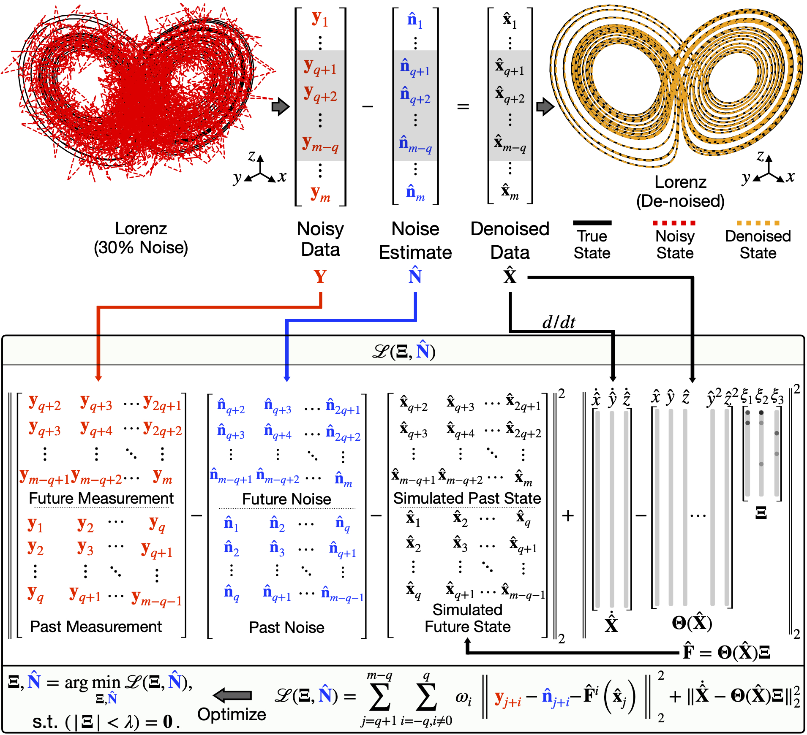

# Simultaneous Denoising and Sparse Identification of Nonlinear Dynamics

Sparse identification of nonlinear dynamics (SINDy) algorithm is a method that allows the identification of parsimonious system models. However, the SINDy algorithm is sensitive to noise. To overcome this issue, we show an alternative approach for simultaneous denoising and identifying sparse nonlinear models. This new noise signal separation SINDy (NSS-SINDy) algorithm dramatically improves noise robustness of original SINDy algorithm and makes the identification of the noise distribution possible. We show several examples here to illustrate the effectiveness of this new member of the SIINDy family. The details of the approach are in our [arXiv paper]().

## Examples
### Lorenz Equations
Lorenz equation is a set of ordinary differential equations famous for having chaotic behavior. We will use the Lorenz equations to demonstrate the noise robustness of NSS-SINDy. Moreover, it is also used to test the performance of NSS-SINDy under different data usage.
### Van der Pol Oscillator
The Van der Pol oscillator is used to demonstrate that NSS-SINDy can tackle different types of noise distributions. Moreover, we show that NSS-SINDy can identify the non-zero mean noise added to the signal.
### Duffing and Cubic Oscillator
Duffing and Cubic oscillators are used to test the effectiveness of NSS-SINDy under different noise levels.
### Lotka-Volterra Equations
The Lotka-Volterra equations are usually used to describe the dynamics of the predator-prey system. We will show that NSS-SINDy can identify the models of Lotka-Volterra equations given noisy measurement data.

## Dependencies:

* Numpy, SciPy, Matplotlib, fitter, and TensorFlow 2.0 packages for Python are needed to run the examples.
* The noisy data needed to compare the modified-SINDy and Weak SINDy can be dowloaded [here](https://drive.google.com/file/d/1OsVjzl41Bhk_drb57VeKvGNHcPm5rUNA/view?usp=sharing).
